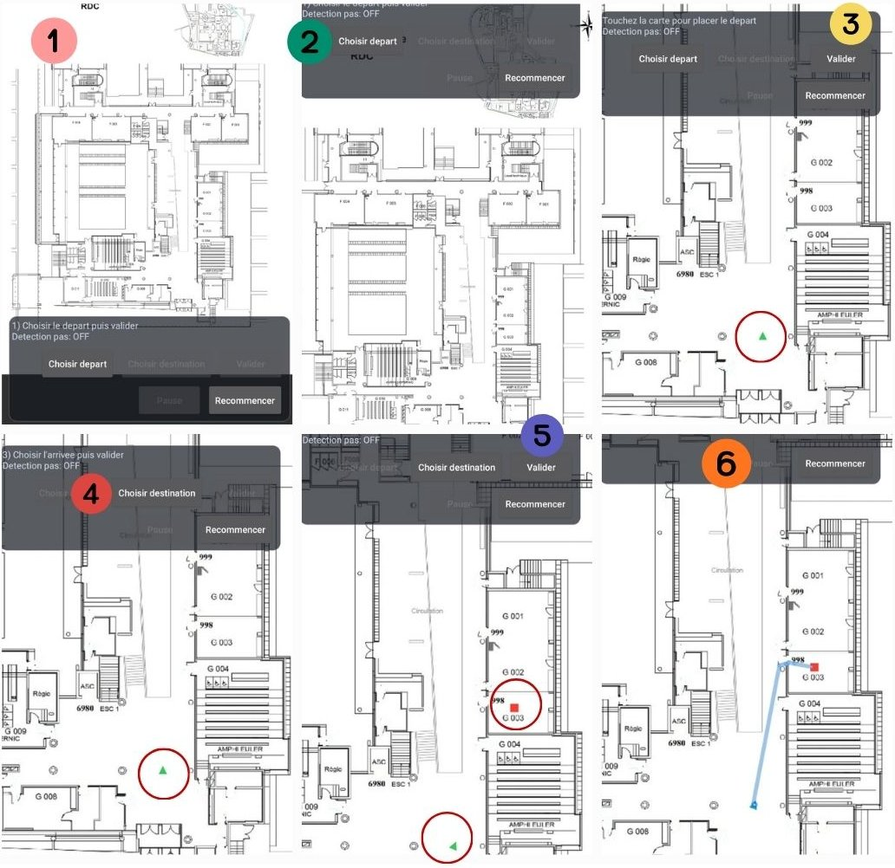
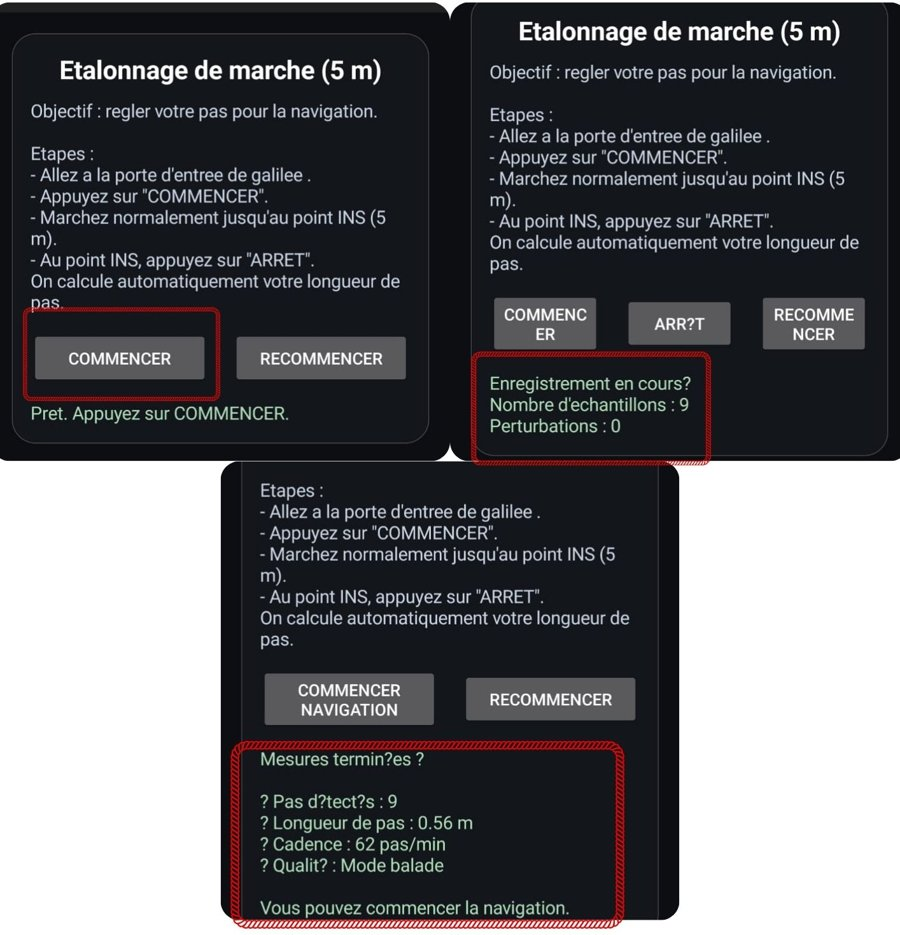
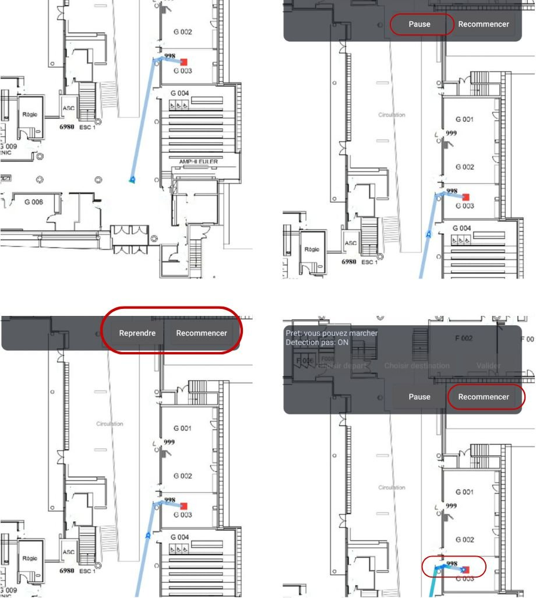

# Navigation indoor sans GPS sur smartphone Android

Application Android de guidage piéton à l'intérieur d'un bâtiment, à partir des capteurs du téléphone (accéléromètre, gyroscope et magnétomètre) : détection de pas, estimation du cap, calcul d'itinéraire par A\* sur le plan du bâtiment et validation des virages au gyroscope.



*Étapes de définition d'un trajet sur le plan du rez-de-chaussée : choix du départ, choix de la destination, itinéraire calculé (captures issues du rapport de projet).*

## Présentation

Le GPS n'est pas exploitable à l'intérieur d'un bâtiment. Ce projet étudie une solution qui ne demande aucune infrastructure (ni balises Bluetooth, ni cartographie Wi-Fi) : l'utilisateur indique son point de départ et sa destination sur un plan, l'application calcule un itinéraire, puis fait avancer sa position le long de cet itinéraire à chaque pas détecté.

- **Cadre** : projet de fin d'études, spécialité Instrumentation et Systèmes Embarqués, Sup Galilée (Université Sorbonne Paris Nord), année 2025–2026.
- **Équipe** : projet réalisé en binôme avec Chaima Jouini, encadré par Christophe Daussy.
- **Bâtiment de test** : rez-de-chaussée de Sup Galilée, dont le plan est embarqué dans l'application.

## État du projet

Projet terminé dans son cadre académique (rapport rendu et soutenance effectuée). L'application fonctionne sur le plan fourni ; elle reste un prototype d'étude et n'est pas maintenue activement. Les limites sont détaillées plus bas.

## Réalisation

Projet réalisé par Tedj El Moulk Sinacer et Chaima Jouini, sous la supervision de Christophe Daussy. Le dépôt rassemble le code de l’application et la documentation du travail mené en binôme.

## Matériel et technologies

| Élément | Détail |
|---|---|
| Matériel | Smartphone Android équipé d'un accéléromètre, d'un gyroscope et d'un magnétomètre |
| Langage | Kotlin (une activité, interface construite avec les vues Android classiques) |
| Capteurs Android | `TYPE_ACCELEROMETER`, `TYPE_GYROSCOPE`, `TYPE_MAGNETIC_FIELD`, `TYPE_ROTATION_VECTOR`, `TYPE_GAME_ROTATION_VECTOR` (cadence `SENSOR_DELAY_GAME`) |
| Outils | Android Studio, Gradle 8.13 (wrapper), Android Gradle Plugin 8.13, Kotlin 2.0.21, JDK 17 |
| Cible | `minSdk` 24, `compileSdk` / `targetSdk` 36 |

Dépendances déclarées mais non utilisées par le code actuel : le module `opencv/` (SDK OpenCV Android 4.12.0, bibliothèque tierce copiée dans le dépôt), CameraX et PhotoView. Elles datent d'essais antérieurs et sont toujours nécessaires à la compilation tant que la configuration Gradle n'est pas allégée.

## Principe de fonctionnement

Tout le traitement se trouve dans [`MainActivity.kt`](app/src/main/java/com/example/sensortomatlab/MainActivity.kt).

### 1. Détection de pas

- Calcul de la norme de l'accélération, puis filtrage par un passe-bande biquad (0,6–3 Hz) dont les coefficients sont recalculés selon la fréquence d'échantillonnage mesurée.
- Recherche des maxima locaux du signal filtré. Un pic n'est compté comme un pas que si son amplitude, sa largeur (120 à 400 ms) et l'intervalle depuis le pic précédent sont cohérents avec la marche de référence de l'utilisateur.

### 2. Étalonnage de la marche



*Étalonnage : consignes, comptage en cours, puis longueur de pas et cadence obtenues.*

Avant la première navigation, l'utilisateur marche sur une distance connue de 5 m. L'application en déduit une longueur de pas, une période de pas de référence (médiane des intervalles) et une amplitude de référence. Un étalonnage est refusé si le nombre de pas détectés est incohérent (hors de 5 à 12) ou si la marche comporte des pauses. Les valeurs sont enregistrées dans les préférences de l'application.

### 3. Estimation du cap

- Le cap provient du vecteur de rotation fourni par Android (fusion accéléromètre, gyroscope et magnétomètre réalisée par le système), converti en angles d'Euler.
- Traitements ajoutés : lissage circulaire (filtre du premier ordre sur le sinus et le cosinus), déroulement de l'angle pour éviter le saut à ±180°, limitation de la vitesse de variation.
- La norme du champ magnétique est surveillée. En cas de perturbation (valeur hors plage, variation brutale ou écart à la moyenne), l'application bascule sur le vecteur de rotation « game », qui n'utilise pas le magnétomètre.
- Au démarrage, le cap est aligné sur la direction du premier segment de l'itinéraire.

Ce projet n'implémente pas de filtre de Kalman ni de filtre de Madgwick : la fusion d'orientation est celle d'Android.

### 4. Calcul d'itinéraire

- Le plan (image JPEG) est converti en grille de cases franchissables : pixels blancs, auxquels s'ajoutent les portes repérées par leur couleur (bleu ou orange) sur le plan.
- Recherche A\* sur une grille au pas de 6 pixels, en 8-connexité, avec une heuristique euclidienne pondérée (coefficient 1,2). Cette pondération accélère la recherche ; le chemin obtenu n'est donc pas garanti strictement le plus court.
- Simplification du chemin par test de visibilité directe entre points.
- Les changements de direction d'au moins 60° sont enregistrés comme virages.

### 5. Suivi de la progression et virages

- À chaque pas accepté, la position avance de la longueur de pas étalonnée **le long de l'itinéraire calculé** (échelle fixe de 30 pixels par mètre). La position n'est pas calculée librement en deux dimensions.
- À l'approche d'un virage, la progression est verrouillée. Elle ne reprend que si une rotation réelle est mesurée : intégration de la vitesse angulaire du gyroscope autour de l'axe vertical dans le sens attendu, et cap aligné à 10° près sur la nouvelle direction. Un délai maximal de verrouillage est également prévu dans le code.
- Retours utilisateur : flèche de position et de cap sur le plan, barre de progression, vibration à l'approche et à la validation d'un virage, boutons Pause, Reprendre et Recommencer.



*Suivi du trajet avec les commandes Pause, Reprendre et Recommencer.*

## Organisation du dépôt

```
app/                 Application Android (code Kotlin, ressources, plan du bâtiment)
opencv/              SDK OpenCV Android 4.12.0 (bibliothèque tierce, non utilisée par le code)
docs/                Rapport de projet (PDF)
Rapport/             Support de soutenance conservé à son emplacement initial
assets/              Captures d'écran utilisées dans ce README
gradle/, gradlew*    Wrapper Gradle
```

## Installation

Prérequis : Android Studio avec un JDK 17, le SDK Android 36, ainsi que le SDK Android 34 pour le module `opencv/`, le NDK et CMake (demandés par ce module).

```bash
git clone https://github.com/tedjelmoulksn-dotcom/INS_with_phone.git
```

1. Ouvrir le dossier dans Android Studio et attendre la fin de la synchronisation Gradle.
2. Brancher un téléphone Android (débogage USB activé) et lancer la configuration `app`.

En ligne de commande : `./gradlew assembleDebug` puis `./gradlew installDebug`.

> Ces commandes n'ont pas été rejouées lors de la mise à jour de cette documentation (pas de SDK Android ni de téléphone dans l'environnement utilisé). La compilation et le fonctionnement sur téléphone restent à vérifier dans un environnement Android complet.

## Utilisation

1. **Étalonner** : appuyer sur COMMENCER, marcher normalement 5 m, puis appuyer sur ARRÊT.
2. **Choisir le départ** sur le plan et valider, puis **choisir la destination** et valider. L'itinéraire s'affiche.
3. **Marcher** en tenant le téléphone devant soi, orienté dans le sens de la marche. La position avance à chaque pas.
4. À chaque virage, tourner réellement avec le téléphone pour que la progression reprenne.

Le plan peut être zoomé et déplacé. Pour un autre bâtiment, il faut remplacer l'image `app/src/main/res/drawable/rdc_galilee.jpg` (zones franchissables en blanc) et ajuster la constante d'échelle `PX_PER_M` dans le code.

## Essais et résultats

Les essais ont été réalisés dans les couloirs du rez-de-chaussée de Sup Galilée, avec plusieurs utilisateurs et plusieurs allures de marche : trajets rectilignes, trajets avec virages à 90°, pauses et reprises.

Constats rapportés dans le rapport :

- détection de pas stable après étalonnage, y compris avec des mouvements parasites ;
- distance parcourue cohérente une fois la longueur de pas personnalisée ;
- virages correctement validés par le mécanisme de verrouillage ;
- légères déviations observées sur les trajets longs ou après plusieurs virages successifs.

Le rapport ne contient pas de campagne de mesures chiffrée (pas d'erreur de position moyenne ni de statistique sur un grand nombre de trajets). Aucun niveau de précision n'est donc annoncé ici.

## Limites et travaux restants

- Plan, échelle et repères d'étalonnage propres à un seul bâtiment et un seul étage.
- La position suit l'itinéraire prévu : si l'utilisateur s'en écarte, l'application ne le détecte pas. Des fonctions de navigation à l'estime libre et de recalage sur le chemin existent dans le code mais ne sont pas appelées dans cette version.
- Une erreur de comptage de pas ou de longueur de pas se reporte directement sur la distance.
- Le téléphone doit être tenu de manière stable ; l'usage en poche n'a pas été traité.
- L'envoi des données vers MATLAB par UDP, utilisé pendant le développement pour visualiser les signaux, est désactivé dans cette version (fonctions vides).
- Tout le code est regroupé dans une seule activité d'environ 3 900 lignes ; un découpage en modules et des tests unitaires restent à faire (seuls les tests générés par défaut sont présents).
- Certains textes de l'interface présentent des défauts d'encodage des accents.
- Pistes identifiées dans le rapport : fusion de capteurs plus avancée, recalage ponctuel par balises ou Wi-Fi, gestion de plusieurs étages.

## Documentation

- [Rapport de projet (PDF, 61 pages)](docs/rapport_navigation_indoor.pdf) : étude de l'existant, traitement du signal, architecture, essais.

## Licence

Aucune licence n'a été définie pour le code de l'application. Le module `opencv/` reste soumis à sa licence d'origine (Apache 2.0) et aux licences tierces listées dans `opencv/etc/licenses/`.
